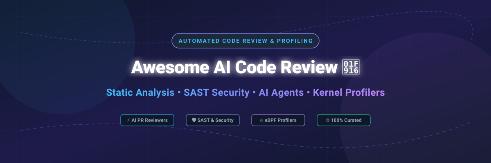

# Awesome-AI-Automated-Code-Review-Profiling 🤖 🔍 ⚡

  

  
  
  
  
  
  

---

## 🌟 Top AI Automated Code Review & Performance Profiling Ecosystem

**Curated List of Commercial AI Code Review Platforms, SAST Security Tools & Open-Source Profiling Frameworks** 🚀  
*Focused on Automated Pull Request Review, Static Code Analysis, Continuous eBPF Profiling & AI Bug Detection* 🛡️  

**Last updated: October 2026** 📅

---

### 📌 Overview & SEO Summary 🔍
Welcome to the ultimate curated directory of **AI automated code review tools**, **open-source static analysis linters**, **SAST vulnerability scanners**, and **performance profiling frameworks**. As software development velocity accelerates with generative AI, automated code quality assurance, security compliance (SAST/SCA), and low-overhead continuous performance profiling have become critical for modern DevOps pipelines.

Whether you are looking for enterprise-grade commercial platforms (such as *Amazon CodeGuru*, *Snyk Code*, *Veracode*, *Checkmarx*, *SonarQube Cloud*, and *Qodo*), or high-performance open-source tools (like *FlameGraph*, *PR-Agent*, *Semgrep*, *CodeQL*, and *Parca*), this list covers category leaders, eBPF profilers, and multi-agent AI review systems. 💡

---

## 📑 Table of Contents 📖
- [🏢 SaaS & Commercial Platforms](#-saas--commercial-platforms)
- [🔓 Open-Source GitHub Projects](#-open-source-github-projects)
- [🛠️ How to Contribute](#%EF%B8%8F-how-to-contribute)
- [📊 Star History](#-star-history)
- [🤝 Support & Sponsorship](#-support--sponsorship)
- [⚠️ Disclaimer](#%EF%B8%8F-disclaimer)

---

## 🏢 SaaS / Commercial Platforms 🌐

> 💡 **Market Size & Structure Analysis (2026):**  
> The global Automated Code Review, SAST, and Developer Security market is estimated at **$7.5 Billion to $9.2 Billion** in 2026, growing at a CAGR of ~22%. The market is currently **moderately fragmented**: incumbent hyperscalers (Amazon AWS) and cybersecurity giants (Snyk, Veracode, Checkmarx) dominate legacy enterprise security scanning, while specialized AI startups (CodeRabbit, Qodo, Sourcery) capture high-growth developer-first PR automation workflows. It is moving towards a oligopolistic structure as platforms bundle static analysis, security scanning, and multi-agent AI reviewers together. 📊

The AI code review market has exploded in 2026, with tools moving from simple linting to multi-agent architectures that validate PRs against Jira tickets and Figma specs. A security field test across 240 seeded defects found CodeRabbit led recall at 64%, followed by Claude Sonnet 4.5 at 61%, Copilot at 54%, Qodo Merge at 49%, and CodeGuru at 41% [citation:11]. Hallucinations still average 18% across the field, with invented CVE numbers being the most dangerous failure mode [citation:11].

*Sorted by Valuation / Market Cap (Descending)* 📈

| SaaS / Commercial Platform | Company / Owner | Valuation / Market Cap 💰 | Standard Edition Starting Price 🏷️ | Free Tier / Free Trial Limits 🎁 | Description 📝 |
| :--- | :--- | :--- | :--- | :--- | :--- |
| **[Amazon CodeGuru](https://aws.amazon.com/codeguru/)** ☁️ | Amazon | ~$2.0 Trillion | $0.50/100 lines (Security Reviewer); $0.75/100 lines (Profiler) | 90-day free trial (up to 100k lines of code) | **AWS's ML-powered code review** — Detects security vulnerabilities and performance issues in Java/Python. Lowest hallucination rate at 11% in field tests, but lower recall at 41% [citation:11]. |
| **[Snyk Code](https://snyk.io/product/snyk-code/)** 🔒 | Snyk | ~$7.4 Billion | $25/month per product / seat (Team plan) | Free tier: 100 SAST code tests per month for private repos; unlimited for open-source | **Developer-first security** — Real-time SAST integrated into IDEs and PRs. DeepCode AI engine with dataflow analysis. |
| **[Veracode](https://www.veracode.com/)** 🏢 | Veracode (Thoma Bravo) | Private (~$2.5 Billion) | ~$10,000/year base tier (SAST module estimate) | 14-day free trial for select modules; demo on request | **Enterprise application security** — SAST, DAST, SCA, and penetration testing. Compliance-focused for regulated industries. |
| **[Checkmarx](https://checkmarx.com/)** 🎯 | Checkmarx (Hellman & Friedman) | Private (~$1.1 Billion) | ~$30,000/year starting tier (Checkmarx One estimate) | 30-day free trial for Checkmarx Developer Assist; demo on request | **Enterprise SAST/SCA/DAST** — CxSAST, CxSCA, and CxSAST Pro. Deep code analysis for large-scale enterprise deployments. |
| **[SonarQube Cloud](https://www.sonarsource.com/products/sonarcloud/)** 🔷 | SonarSource | Private (~$4.7 Billion) | €10/month (starting at 100k LOC) | Free for public repos; 14-day free trial for private repos | **The industry standard for static analysis** — 30+ languages, SAST, code smells, security hotspots. 7M+ developers use SonarQube [citation:10]. |
| **[CodeRabbit](https://coderabbit.ai/)** 🐰 | CodeRabbit | Private (~$500 Million) | $24/dev/month (Essentials); $48/dev/month (Team) | Free tier: Unlimited PR summarization, VS Code/CLI reviews, free for OSS; 14-day Pro free trial | **AI-first code review** — Led recall at 64% in independent field tests [citation:11]. Self-hosting is Enterprise-only (~$15k/mo, 500-seat minimum) [citation:16]. |
| **[Qodo (formerly CodiumAI)](https://www.qodo.ai/)** 🧠 | Qodo | Private (~$250 Million) | $19/dev/month (Pro); $30/dev/month (Team) | Free tier: Up to 75 PR reviews per organization per month [citation:6] | **Multi-agent AI code review** — Qodo 2.0 uses specialized agents analyzing bugs, security, rules, and requirements in parallel. Validates PRs against Jira/Azure DevOps tickets [citation:6]. |
| **[Tabnine](https://www.tabnine.com/)** 💡 | Tabnine | Private (~$150 Million) | $12/user/month (Dev plan, billed annually) | Free basic AI code completion; 14-day Pro free trial | **AI code assistant with review features** — Code completion, chat, and PR review. Enterprise deployment with VPC/on-prem options. |
| **[Codacy](https://www.codacy.com/)** 🔍 | Codacy | Private (~$100 Million) | $15/user/month (Pro plan, billed annually) | Free for open-source & public repos; up to 14-day Pro trial | **Mature rule library since 2012** — 40+ languages, AI Reviewer (GitHub-only) uses Gemini models for context-aware analysis. Strongest for polyglot and legacy codebases [citation:6]. |
| **[Code Climate](https://codeclimate.com/)** 📊 | Code Climate | Private (~$80 Million) | $16.67/user/month (Team plan, billed annually) | Free for open-source repos; 14-day free trial | **Engineering intelligence platform** — Automated code review, test coverage, maintainability metrics. Quality and velocity dashboards for engineering leaders. |
| **[DeepSource](https://deepsource.com/)** 🛡️ | DeepSource | Private (~$50 Million) | $12/user/month (Team plan) | Free for open-source repos & individual developers (up to 3 private repos); 14-day free trial | **AI-powered static analysis** — 10+ languages, security, performance, and anti-pattern detection. Autofix capabilities for common issues. |
| **[Sourcery](https://sourcery.ai/)** ⚡ | Sourcery | Private (~$30 Million) | $12/user/month (Lite); $24/user/month (Pro) | Free for public repos & open-source projects [citation:6] | **Adaptive learning code review** — Adjusts to team feedback, stops flagging dismissed patterns. 30+ languages, PR diagrams, test generation [citation:6]. |

---

## 🔓 Open-Source GitHub Projects 🐙

*Sorted by GitHub_Stars_Count (Descending)* 🌟

- **[FlameGraph](https://github.com/brendangregg/FlameGraph)**  🔥  
  **Visualize profiled stack traces**, CDDL-1.0 licensed. Brendan Gregg's foundational tool for generating flame graphs from `perf`, DTrace, and other profiler outputs.

- **[analysis-tools-dev/static-analysis](https://github.com/analysis-tools-dev/static-analysis)**  📚  
  **Curated list of static analysis tools and linters for all languages**, MIT licensed. The definitive directory for discovering SAST tools, linters, and code quality analyzers across every programming language [citation:5].

- **[PR-Agent (Qodo)](https://github.com/qodo-ai/pr-agent)**  🚀  
  **Open-source AI code review agent**, AGPL-3.0 licensed. The community-maintained legacy project of Qodo. Supports GitHub, GitLab, Bitbucket, Azure DevOps, and Gitea. Single LLM call per tool (~30 seconds, low cost), PR Compression for large diffs, JSON-based prompt customization. Self-hosted with your own API keys [citation:3][citation:16].

- **[Semgrep](https://github.com/semgrep/semgrep)**  🛡️  
  **Lightweight static analysis for security**, LGPL-2.1 licensed. Pattern-based scanning across 30+ languages. Fast, customizable rules for finding bugs and security issues in CI/CD pipelines.

- **[CodeQL](https://github.com/github/codeql)**  🧬  
  **Semantic code analysis engine by GitHub**, MIT licensed. Query-based vulnerability detection that treats code as data. Powers GitHub's code scanning feature.

- **[Detekt](https://github.com/detekt/detekt)**  🎯  
  **Static code analysis for Kotlin**, Apache-2.0 licensed. Complexity metrics, code smell detection, and style checking for Kotlin projects. Highly configurable with rule sets [citation:10].

- **[Clockwork (PHP)](https://github.com/itsgoingd/clockwork)**  ⏰  
  **PHP dev tools in your browser**, MIT licensed. Profiling, logging, and debugging for PHP applications directly in the browser [citation:4].

- **[Pylint](https://github.com/pylint-dev/pylint)**  🐍  
  **Static code analyzer for Python**, GPL-2.0 licensed. The most comprehensive Python linter — detects errors, enforces coding standards, and suggests refactoring. Plugin system for framework-specific checks [citation:10].

- **[flamegraph-rs/flamegraph](https://github.com/flamegraph-rs/flamegraph)**  🦀  
  **Easy flamegraphs for Rust and everything else**, MIT licensed. Rust-based replacement for Perl scripts — generates flame graphs without pipes or Perl dependencies [citation:4].

- **[PMD](https://github.com/pmd/pmd)**  ☕  
  **Extensible multilanguage static analyzer**, BSD-4-Clause licensed. Finds unused variables, empty catch blocks, unnecessary object creation, and more across Java, Apex, and other languages [citation:10].

- **[bytehound](https://github.com/koute/bytehound)**  🧠  
  **Memory profiler for Linux**, MIT/Apache-2.0 licensed. Traces allocations with minimal overhead. Web-based UI for analyzing memory usage over time [citation:4].

- **[parca](https://github.com/parca-dev/parca)**  📈  
  **Continuous profiling platform**, Apache-2.0 licensed. Analyzes CPU and memory usage down to the line number over time. eBPF-based collection, saves infrastructure cost and improves reliability [citation:4].

- **[hotspot (KDAB)](https://github.com/KDAB/hotspot)**  🖥️  
  **Linux perf GUI for performance analysis**, GPL-2.0 licensed. Qt-based graphical frontend for `perf.data` files with flame graphs, call trees, and source annotation [citation:4].

- **[gprof2dot](https://github.com/jrfonseca/gprof2dot)**  📊  
  **Converts profiling output to dot graph**, LGPL-3.0 licensed. Parses `perf`, `gprof`, `callgrind`, and other profiler outputs into Graphviz visualizations [citation:4].

- **[Bearer](https://github.com/Bearer/bearer)**  🐻  
  **Code security scanning (SAST)**, Elastic License 2.0. Discovers, filters, and prioritizes security and privacy risks. Data flow analysis for finding sensitive data leaks [citation:10].

- **[MegaLinter](https://github.com/oxsecurity/megalinter)**  🦙  
  **Analyzes 50 languages in one tool**, MIT licensed. Runs 100+ linters and formatters in a single Docker container. GitHub Action, CI integration, or local execution [citation:10].

- **[Scalene](https://github.com/plasma-umass/scalene)**  ⚡  
  **High-performance CPU, GPU, and memory profiler for Python**, Apache-2.0 licensed. Uses AI-powered optimization proposals and line-level profiling accuracy with low overhead.

- **[py-spy](https://github.com/benfred/py-spy)**  🕵️  
  **Sampling profiler for Python programs**, MIT licensed. Allows visualizing Python application flame graphs without modifying code or restarting processes.

- **[ai-review (Nikita-Filonov)](https://github.com/Nikita-Filonov/ai-review)**  🔄  
  **AI-powered code review for multiple platforms**, MIT licensed. Supports GitHub, GitLab, Bitbucket Cloud/Server, Azure DevOps, and Gitea. Works with OpenAI, Claude, Gemini, Ollama, OpenRouter, and Azure OpenAI [citation:18].

- **[aiprofile](https://github.com/arnaudmiribel/aiprofile)**  🤖  
  **AI-powered Python profiling CLI**, MIT licensed. Uses Scalene for CPU/memory profiling (5-10% overhead) and Claude AI for optimization recommendations. Beautiful terminal output with rich formatting [citation:7].

- **[codespy-ai](https://github.com/khezen/codespy)**  🕵️‍♂️  
  **AI code review CLI with MCP server**, MIT licensed. Reviews GitHub/GitLab PRs, local changes, and uncommitted work. IDE integration via Model Context Protocol for Cline and other assistants [citation:13].

- **[nusku](https://github.com/nuskum/nusku)**  🔭  
  **Continuous profiling for Linux with eBPF**, MIT licensed. Built in Zig. Real-time CPU/memory/thread/syscall/network visibility without configuration. Local or remote streaming [citation:9].

- **[Alnoms](https://github.com/ArpraxLab/alnoms)**  🔬  
  **Pre-deployment algorithmic performance intelligence**, MIT licensed. Combines static pattern detection, empirical profiling, and complexity estimation. Detects hidden O(N²) loops and silent complexity traps before production [citation:12].

- **[ReviewSensei](https://github.com/review-sensei/review-sensei)**  🥋  
  **Bounded AI code review with hard limits**, CC0-1.0 licensed. Provider-neutral core with strict byte/line/comment limits. Offline evaluation corpus. Deterministic regression testing [citation:8].

- **[MTuner](https://github.com/RudjiGames/MTuner)**  🎮  
  **C/C++ memory profiler and leak finder**, BSD-2-Clause licensed. Supports Windows, PlayStation 3/4/5, Nintendo Switch, and Android. Timeline-based memory analysis [citation:4].

---

## 🛠️ How to Contribute 🤝

Contributions are welcome! Follow these steps to submit new AI code review platforms or open-source profiling software:

1. 🍴 **Fork** the repository.
2. 📝 **Add/edit** entries in `README.md` maintaining table/list structure and formatting.
3. 🔗 Include project title, official website/GitHub link, exact Stars_Count, license, and brief description.
4. 🚀 Submit a **Pull Request** with a descriptive summary of your changes.

---

## 📊 Star History

---

## 🤝 Support & Sponsorship

Thank you for visiting and supporting the **Awesome AI Automated Code Review & Profiling** project! 💖

If you find this open-source directory helpful for discovering code review automation tools and performance profilers, please consider showing your support:

- ⭐ **Star** this repository to increase visibility for developers and security teams!
- 🔀 **Fork & Share** with your engineering colleagues and DevOps networks.
- ☕ **Buy Me a Coffee / Sponsor**: Support ongoing maintenance and curation of open-source resources via the [GitHub Sponsor Dashboard](https://github.com/sponsors/ishandutta2007).

---

## ⚠️ Disclaimer 🔒

- This is a **community-curated** list — not exhaustive and not an endorsement. ℹ️
- AI code review tools still produce hallucinations averaging 18% across the field, with invented CVE numbers being especially dangerous [citation:11]. **Always verify findings** before acting on them. 🔒
- Open-source tools (Semgrep, PR-Agent, CodeQL, FlameGraph) provide powerful foundations for custom code review and profiling pipelines, but enterprise-grade SLA guarantees, compliance certifications, and vendor support remain primarily commercial offerings. 🤖

---

  <b>Made with ❤️ for developers, security engineers, and open-source code quality advocates.</b>

